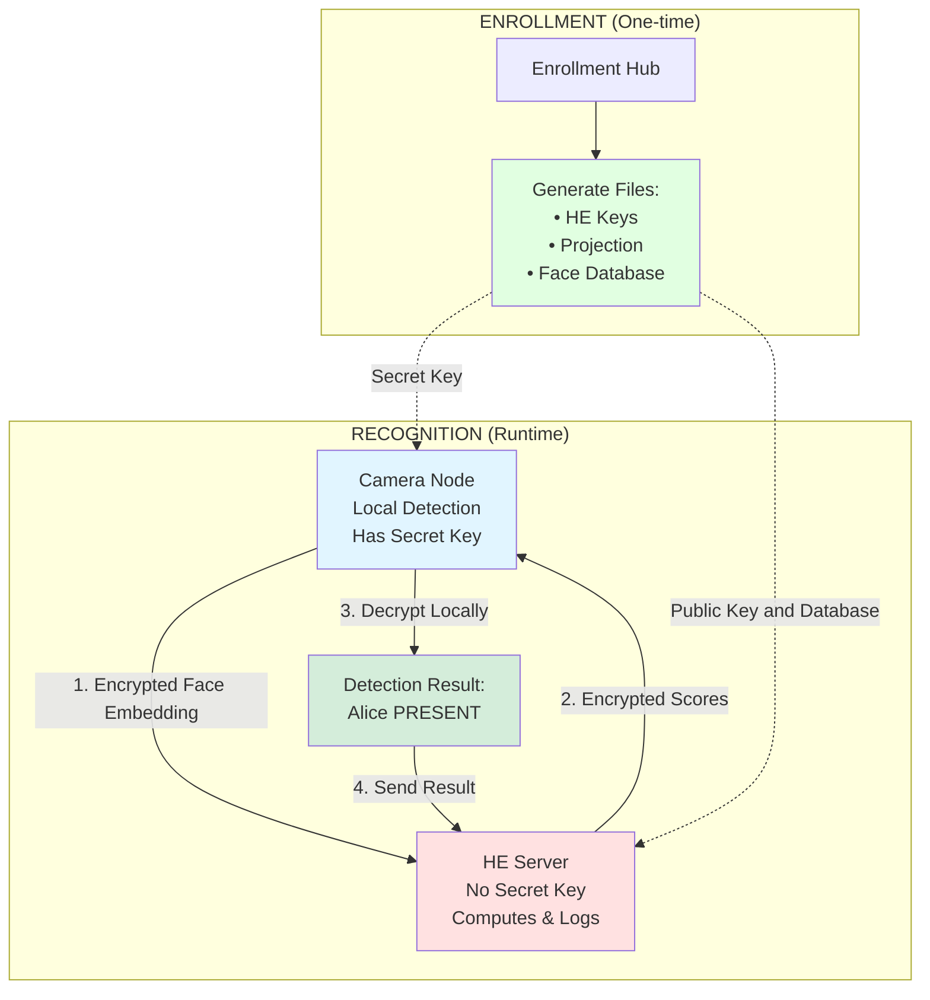

# Privacy-First Face Presence with Homomorphic Encryption

## Overview

This system demonstrates privacy-preserving face recognition where raw video never leaves the device. The camera performs local face detection and computes encrypted embeddings using homomorphic encryption (HE), sending only ciphertexts to the server. The server carries out encrypted similarity matching without ever accessing plaintext data. This design prevents attackers from intercepting or viewing camera footage, even if the server or network is compromised, since the raw video remains entirely on the camera device.

### Key Privacy Features

- **No raw video transmission** - Only encrypted 128-D vectors leave the camera
- **Homomorphic computation** - Server compares faces while data remains encrypted
- **Server-side blindness** - Server never has secret key, cannot decrypt footage

### Security Considerations

**Protected:**
- Network traffic is encrypted (CKKS ciphertexts)
- Server cannot view raw video
- Minimal attack surface for live feed hijacking

**Limitations:**
- Enrollement embeddings database is plaintext on server
- Secret key (`he_secret_ctx.bin`) must be protected on camera node
- Bad actor could still access detection logs
- Hardware tampering could compromise camera directly

---
## System Architecture



**Flow:**
1. Camera encrypts face embedding → sends to server
2. Server computes similarity (homomorphic) → returns encrypted scores (server is blind to raw video)
3. Camera decrypts scores locally → determines "Alice PRESENT"
4. Camera sends plaintext result back to server for logging
5. Server logs detection without ever decrypting scores or seeing video
---

## System Components

### 1. Enrollment Hub
Generates HE contexts, captures face samples, and creates the enrollment database.

**Responsibilities:**
- Create CKKS encryption context (one-time setup)
- Generate random projection matrix (512-D → 128-D)
- Capture and average multiple face samples per identity
- Store normalized embeddings in `faceid_db_server.json`

### 2. Camera Node
Captures video, detects faces locally, encrypts embeddings, and sends to server.

**Responsibilities:**
- Local face bounding box detection and embedding computation
- Project embeddings (512-D -> 128-D) and normalize
- Encrypt with CKKS and transmit only ciphertexts
- Display HUD with detection feedback (demo only)

### 3. HE Server
Receives encrypted probes, performs homomorphic similarity matching, and logs decrypted detection results from camera.

**Responsibilities:**
- Load enrollment database (plaintext embeddings + names)
- Compute homomorphic dot products on encrypted probes
- Return encrypted scores to camera (server cannot decrypt)
- Receive and log detection results from camera

---

## Quick Start

**Note:** Python 3.10 is the version I tested on and would reccomended using.

### Installation

```bash
# Navigate to project directory
cd homomorphic-face-detection

# Activate your virtual environment
source .venv/bin/activate

# Install the package in editable mode
pip install -e .
```

This installs the `faceid` package and creates three command-line tools:
- `faceid-enroll` - Enrollment Hub
- `faceid-camera` - Camera Node
- `faceid-server` - HE Server

### Basic Setup (Local Camera)

**Step 1: Enroll an identity**

```bash
faceid-enroll --enroll-name "Alice" --input camera --source 0 --avg-samples 5
```

- Press `e` to capture samples (5 times from different angles)
- Press `q` to quit when done
- Creates: `he_public_ctx.bin`, `he_secret_ctx.bin`, `he_proj.npy`, `faceid_db_server.json`

**Step 2: Start the server**

```bash
faceid-server
```

- Listens on `127.0.0.1:9009` for encrypted probes
- Logs detection results sent from camera

**Step 3: Start the camera node**

```bash
faceid-camera --input camera --source 0 --he-send-fps 1
```

- Opens preview window (local only)
- Sends encrypted probes every ~1 second
- Camera logs: `[CAM] Detection: Alice (score 0.92) -> PRESENT`
- Server logs: `[SERVER] Detection logged: Alice -> PRESENT`
- Press `v` to toggle encrypted data visualization (shows jumbled pixels that server receives)

---

## WSL/Network Mode

If your camera is on Windows and you're running the system in WSL/Linux, stream video over UDP with FFmpeg.

### Windows Side (PowerShell)

```powershell
ffmpeg -f dshow -i video="Integrated Camera" `
  -vf scale=640:-1,fps=15 `
  -vcodec libx264 -preset ultrafast -tune zerolatency `
  -g 30 -x264-params "keyint=30:min-keyint=30:scenecut=0:repeat-headers=1" `
  -b:v 1.2M -maxrate 1.2M -bufsize 2.4M `
  -pix_fmt yuv420p `
  -f mpegts ("udp://{0}:5000?pkt_size=1316" -f (
    (wsl hostname -I) -split '\s+' |
    ? { $_ -match '^\d{1,3}(\.\d{1,3}){3}$' } |
    select -First 1
  ))
```

### WSL/Linux Side

```bash
# Enroll from UDP stream
faceid-enroll --enroll-name "Alice" --input udp --udp-url "udp://@0.0.0.0:5000" --avg-samples 5

# Start server
faceid-server

# Start camera node (reading UDP, sending encrypted probes)
faceid-camera --input udp --udp-url "udp://@0.0.0.0:5000" --he-send-fps 1
```

**Troubleshooting UDP:**
- Verify Windows firewall allows outbound UDP to WSL IP:5000
- Test reception: `ffplay -fflags nobuffer -flags low_delay -i udp://@0.0.0.0:5000`

---

## Enrollment Best Practices

### Multi-Sample Averaging (Recommended)

Capture 3-5 samples per identity from slightly different angles/lighting:

1. Press `e` when face is centered and well-lit
2. Rotate head slightly (small yaw/pitch changes)
3. System auto-finalizes after N samples (default: 5)

**Why average?** Single embeddings vary with micro-expressions and noise. Averaging produces stable templates with better separation between identities.

### Enrollment Controls

- `e` - Capture sample
- `f` - Finalize early (average current samples)
- `r` - Reset sample buffer
- `s` - Save snapshot
- `q` - Quit

### Quality Filters

- Minimum bbox area: 9000 pixels (configurable via `--min-bbox-area`)
- Small/blurry faces are automatically skipped

---

## Tuning Recognition

All configuration is in `config.yaml`. Edit values and restart components to apply changes.

### Threshold Adjustment

```yaml
threshold: 0.9  # Higher = stricter, Lower = more lenient
```

Typical ranges:
- `0.95+` - Very strict, minimal false positives
- `0.85-0.90` - Balanced (recommended)
- `<0.80` - Lenient, may trigger on similar faces

### Projection Dimension

```yaml
proj_dim: 128  # Default: fast HE operations, good accuracy
```

**Note:** Changing `proj_dim` requires re-enrollment (delete `he_proj.npy` and `faceid_db_server.json`).

### Context Consistency

All three components must use the **same HE context**. Verify fingerprints match:

```
[HUB] Using existing HE context. Public FP=a1b2c3d4e5f6g7h8
[SERVER] Loaded cached public context.
[CAM] Loaded HE context. Public FP=a1b2c3d4e5f6g7h8
```

If mismatched, copy `he_public_ctx.bin` and `he_secret_ctx.bin` from Enrollment Hub to all nodes.

---

## File Reference

| File | Description | Security |
|------|-------------|----------|
| `he_public_ctx.bin` | CKKS public context | Safe to share |
| `he_secret_ctx.bin` | CKKS secret key | **Keep secure!** |
| `he_proj.npy` | Projection matrix (512→128) | Safe to share |
| `faceid_db_server.json` | Enrollment database | **Biometric data - protect** |
| `config.yaml` | System configuration | Safe to share |

**Deployment:** Copy `he_public_ctx.bin`, `he_secret_ctx.bin`, `he_proj.npy`, and `faceid_db_server.json` from Enrollment Hub to Server and Camera nodes.

---

## Command Reference

### Enrollment Hub

```bash
faceid-enroll \
  --enroll-name "Name" \
  --input {camera|udp} \
  --source 0 \
  --avg-samples 5 \
  --min-bbox-area 9000 \
  --device {auto|gpu|cpu}
```

### Camera Node

```bash
faceid-camera \
  --input {camera|udp} \
  --source 0 \
  --he-send-fps 1.0 \
  --server-host 127.0.0.1 \
  --server-port 9009 \
  --device {auto|gpu|cpu}
```

### HE Server

```bash
faceid-server
```

Server configuration is in `config.yaml`.

---

## Troubleshooting

**Random huge scores (±1e7):**
- HE context mismatch. Copy `he_secret_ctx.bin` from Enrollment Hub to all nodes and restart.

**ConnectionRefusedError:**
- Start server first
- Verify `--server-host` and `--server-port` match
- Check firewall allows TCP/9009

**No video on UDP:**
- Confirm FFmpeg is running on Windows
- Verify destination IP is correct (WSL IP, not 127.0.0.1)
- Test with: `ffplay -fflags nobuffer -flags low_delay -i udp://@0.0.0.0:5000`

**CUDA not available:**
- Check `onnxruntime-gpu` is installed
- Verify CUDA/CuDNN compatibility
- Use `--device cpu` as fallback

---

## Performance Notes

- **GPU recommended** for face detection/embedding
- **CPU fallback** available but much slower
- **HE operations** are CPU-bound but fast on 128-D vectors
- **Send frequency** of 1 Hz balances responsiveness and compute load (set lower or higher depending on needs and hardware)

---
